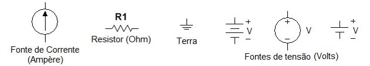
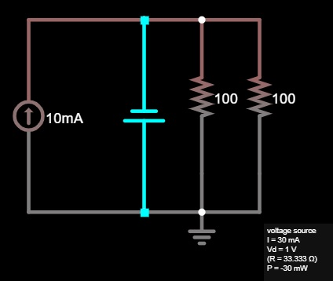
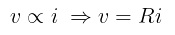
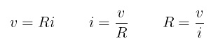
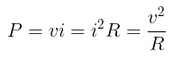
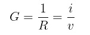
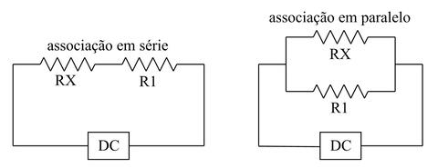

# Análise de Circuitos - pt.1

## Introdução

Inicialmente, será abordado a composição de um circuito elétrico, considerando que é fundamental ter em mente as definições mais básicas sobre cada componente para facilitar a compreensão do seu funcionamento.

Para o estudo nessa fase inicial será usado o site [Circuit Simulator Applet (falstad.com)](https://www.falstad.com/circuit/) para ilustrar e verificar os circuitos. Ele foi escolhido por ser gratuito, bastando apenas acessar o site e já está pronto para uso, ter fácil navegação e ótima exibição do que está acontecendo no circuito, aprensetando todas as características de cada componente. 

Os circuitos mais elementares podem ser resumidos em quatro componentes principais: resistores, fontes de corrente, fontes de tensão e o fio terra. Todos eles podem ser apresentados de maneiras diferentes, mas aqui serão usadas as seguintes notações:

Abaixo está um circuito utilizando o site Circuit Simulator Applet para já ir familiarizando com o ambiente.

Descrevendo rapidamente o circuito, pode-se dizer que todos os componentes estão em *paralelo*, sendo dois resistores de 100 *Ohms* (****Ω****), uma fonte de tensão 1 *Volt* (**V**), uma fonte de corrente de 10 *miliampères* (**mA**) e o fio terra na parte inferior. As fontes são responsáveis por fornecer energia para o o circuito e os resistores possibilitam controlar o fluxo de carga elétrica em determinado segmento através do *efeito Joule*, o qual é cararacterizado por transformar energia elétrica em térmica acarretando na alteração no fluxo de carga elétrica/corrente.

## Lei de Ohm

A **Lei de Ohm**, nomeada em homenagem ao seu descobridor Georg Simon Ohm (1787-1854), afirma que a tensão **V** em um resistor é diretamente proporcional à corrente **i** que o atravessa.

Essa equação é de suma importância porque por meio dela é possivel determinar os valores de tensão, corrente e resistência dos componentes, fazendo simplesmente as seguintes relações algébricas:

Ademais, pode-se usar o mesmo procedimento com a equação da potência, que possui *Watts* (**W**) como unidade de medida.

Outra medida muito presente na análise de circuitos é a *condutância*, a qual é equivalente ao inverso da resistência, sendo a medida que diz o quanto um componente é capaz de conduzir corrente elétrica. Sua unidade de medida é dada por *mho* (****℧****) ou *siemens* (**S**).

### Exemplo de aplicação da Lei de Ohm:

Considerando um ferro elétrico que drena 2 A em uma tensão de 120 V. Determine qual a sua resistência interna.

> Resposta: R = v/i = 120/2 = 60 Ω

## Topologia de rede

O circuito geralmente é chamada de *rede* ao se tratar da sua topologia. A topologia de rede é sobre as propriedades ligadas a como os componentes estão dispostos na rede, considerando a sua configuração geométrica das conexões. A rede é composta por ramos, nós e laços.

> O *ramo* é um elemento único como o resistor ou fonte. 

Na verdade ser generalizado para se tratar de qualquer elemento que possui dois terminais. Por exemplo, o circuito apresentado no início é formado por 4 ramos: 2 resistores, 1 fonte de tensão e 1 fonte de corrente. Vale destacar que o terra *não* é um ramo porque ele possui apenas um terminal.

> O *nó* é apenas um ponto de conexão entre dois ou mais ramos.

No circuito, o nó é identificado por um ponto. No entanto, ainda usando o circuito ilustrado anteriormente como exemplo, quando componentes estão conectados paralelamente, eles possuem um nó em comum, já que não existe nada entre a conexão deles. Por isso, aquela rede tem apenas 2 nós: 1 na parte superior e 1 na parte inferior, sendo duas linhas que ligam todos os elementos.

> O *laço* é qualquer caminho fechado no circuito.

O caminho em si do laço na rede é arbitrária, mas deve partir de um nó, seguir por qualquer caminho e retornar para o ponto de partida sem passar por qualquer nó mais de uma vez. Diz-se que o laço é *independente* se nele tiver ao menos um *ramo* que não é compartilhado por outro laço independente.

As equações para a análise de rede é baseada nesses conceitos, onde cada um pode fornecer meios de como montar as equações que determinam o comportamento de dado elemento, em função da corrente e tensão no circuito.

Além disso, os elementos podem ser conectados de duas formas: em *série* e em *paralelo*. 

Considera-se que estão conectados em **paralelo** (acredito que você já tenha alguma ideia do que se trata pelos exemplos anteriores) quando dois ou mais elementos possuem dois nós em comum, o que acarreta em terem a mesma tensão. Já os que ficam conectados em **série** compartilham exclusivamente um único nó, onde passa a mesma corrente.

Então, na próxima postagem dessa série de estudos (minha revisão) sobre circuitos elétricos iremos adentrar nas Leis de Kirchhoff e já conseguiremos realizar algumas análises de circuitos.

> Materias de base: Análise básica de Circuitos para Engenharia - IRWIN 10° edição; Fundamentos Circuitos Elétricos - SADIKU.
