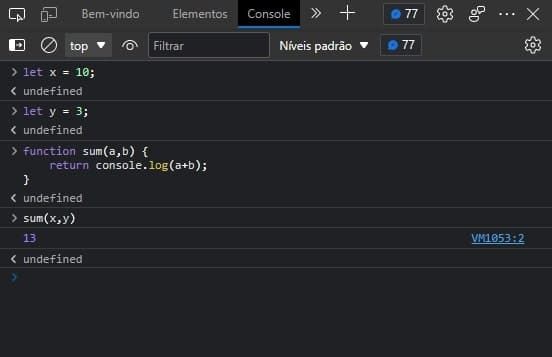
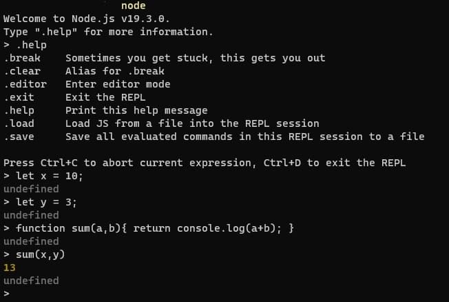

# Introdução ao JavaScript

## Um pouco de história

Para início de conversa, você sabia que o nome oficial da linguagem de programação JavaScript na verdade é ECMAScript?

Então, para resumir a história, o que aconteceu foi que a Netscape - empresa fundadora da linguagem - batizou inicialmente o nome da linguagem como JavaScript, e foi como ficou popularizada. Mas depois houve problemas de licenciamento, pois a empresa Sun MicroSystems (atual Oracle) já tinha a linguagem Java, licenciada como "Java-script". Com isso, a Netscape precisou procurar outra alternativa.

Analisando o cenário da linguagem e vendo que ela foi submetida a padronização para a ECMA - Associação de Fabricantes de Computadores Europeus -, foi decidido que o nome oficial seria "ECMAScript".

Na prática, esse conhecimento é mais importante para entender o porquê do nome de versões do JavaScript para pesquisas e ficar por dentro das atualizações, que são referenciadas pela sigla "ES" (abreviação de ECMAScript) acompanhada pelo ano da atualização - ES2018, ES2019, ES2020 são exemplos.

## Funcionamento do JavaScript

O JavaScript é principalmente ligado ao desenvolvimento web, sendo o navegador o principal ambiente de execução do código. O ambiente do navegador permite que obtenha entradas pelo mouse e teclado do usuário através de requisições HTTP, além de permitir a exibição da saída em formato de HTML e CSS.

No entanto, desde 2010 foi disponibilizado outro ambiente para a execução do JavaScript, para não ficar preso apenas às funcionalidades dos navegadores. O NodeJS permite que o usuário controle todo o sistema operacional além de receber e enviar solicitações HTTP. Assim, o Node acabou se tornando uma opção viável e popular para implementar servidores web e usar o JavaScript para criação de scripts utilitários.

## Primeiros passos

A forma mais eficiente de aprender alguma coisa nova é mexendo e testando por si mesmo para verificar o funcionamento das coisas até que se torne intuitivo, pois isso mostra que aprendeu de verdade. Sendo assim, vamos testar alguns códigos em JavaScript. Para isso, é necessário usar um interpretador da linguagem.

O jeito mais fácil de ter o primeiro contato com o JavaScript sem precisar instalar nada, basta abrir algum navegar e acessar a parte de "ferramentas de desenvolvedor web" (pressione F12, ou Ctrl-Shift-i, ou Command-Option-i) e escolher a aba de "Console". Aqui você já está livre para digitar alguns códigos e pressionar enter para executar e ver o que acontece.

Outro modo de usar o JavaScript é instalando o Node pelo site [https://nodejs.org](https://nodejs.org). Assim que a instalação estiver completa, você pode usar o terminal do computador e digitar **node** para entrar na sessão interativa do JavaScript.

## Hello World (de lei)

Quando você quiser experimentar criar blocos maiores de códigos é melhor criar um arquivo próprio onde você pode navegar livremente por ele. Para indentificar os arquivos próprios de código JavaScript, usa-se a terminação ".js". Nesse exemplo iremos criar o "hello.js" e escrever o seguinte código.

`console.log("Hello World!");`

Agora você pode executar ele de duas formas:

1. Indo no terminal e abrindo o arquivo usando a linha de comando;
  
  `$ node hello.js`
  
2. Criar um arquivo HTML e invocar o arquivo JavaScript para abrir no navegar.
  
  Nessa opção é necessário criar o arquivo HTML (hello.html) e inserir a tag "" com a localização do arquivo JS.
  
  ``
  
  Quando executar o arquivo HTML então abrirá uma aba no navegador com a URL parecida com
  
  `file://Users/username/hello.html`
  

## Textos no Programa JavaScript

O JavaScript é uma linguagem *case-sensitive*. Ou seja, ela diferencia letras maiúsculas de minúsculas, o que dá mais possibilidades para nomear funções, variáveis  e outros identificadores.

Toda linguagem de programação possue algumas palavras que são reservadas e não podem ser usadas em outro contexto, exceto para o qual ela foi criada. No JavaScript, por exemplo, a palavra "while" só pode ser usada no contexto chamado de *laços de repetição* (veremos melhor no futuro), mas se alterar e usar alguma letra maiúscula como "While" ou "WHILE", não haverá problemas.

Além disso, em geral o JavaScript ignora quebra de linhas para que você consiga criar novas linhas e identar de forma que o código fique mais organizado e legível. Mas é preciso tomar cuidado, pois se for feita de forma errada pode causar problemas na execução do código.

As exceções que não deve ocorrer a quebra de linha é após as palavras reservadas *return, yield, throw, break*, e *continue*. Além disso, não pode ter quebra linha após os operadores **++** e **--** , e após o símbolo de "*arrow function*" (=>), que nada mais é do que uma forma resumida de declarar uma função. Um exemplo de como não usar a liberdade dada pelas quebra de linha:

`return
true;`

O JavaScript irá interpretar como `return; true;` e pode gerar um erro.

### Palavras Reservadas

Aqui estão todas as palavras que são reservadas para a construção do código JavaScript e só podem ser empregradas para desempenhar a função pela qual foi feita.

`as const export get null target void`

`async continue extends if of this while`

`await debugger false import return throw with`

`break default finally in set true yield`

`case delete for instanceof static try`

`catch do from let super typeof`

`class else function new switch var`

Todas essas palavras são reservadas pois já desempenham um papel na linguagem, mas tem outras palavras que são reservadas para possível uso em futuras versões como:

`enum implements interface package private protected public arguments eval`

## Próximos Passos

Bom, se você chegou até aqui e conseguiu pelo menos seguir as explicações posso te dar meus parabéns, mas acredito que se essa for seu primeiro contato com uma linguagem de programação tiveram algumas coisas que você não entendeu porque ainda não foram explicadas. No entanto, dou a boa notícia que tudo exposto aqui será estudado mais a frente, onde será mais aprofundado sobre a sintaxe e comportamento da linguagem com mais exemplos.

Então, valeu pela atenção e até a próxima!