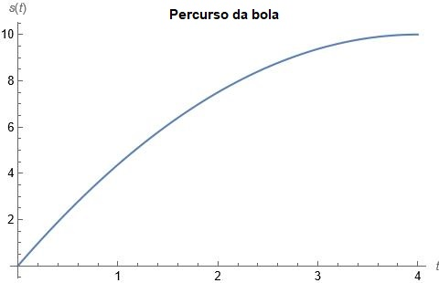
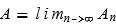
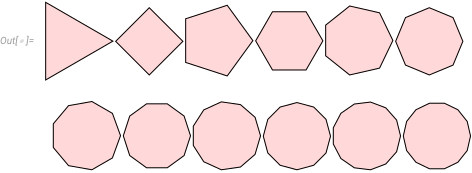

Em primeiro lugar, é preciso entender do que se trata o estudo de Cálculo e no que se baseia a expressões matemáticas que serão abordadas. O Cálculo é o ramo da matemática que lida com coisas mais dinâmicas, que apresentam comportamentos que podem ser bem representados por gráficos de linhas. Como exemplo podemos pegar o movimento de uma bola que é chutada pelo goleiro em direção ao meio do campo de futebol. O percurso da bola pode ser descrito por um gráfico que traça a distância inicial (antes do goleiro chutar) até a distância final (quando atinge o chão) em relação ao tempo que ela demorou para realizar o trajeto. Esse caso pode ser matematicamente descrito como uma **função** que relaciona a distância (*s*) da bola no momento (*t*), sendo reescrita por *s(t)*, onde cada instante *t* estará associado a um valor *s*.

Agora que já foi apresentado o conceito inicial de funções matemáticas, vamos olhar mais produndamente os dois problemas fundamentais que deram origem ao estudo do cálculo. Eles são conhecidos como o "Problema da área" e o "Problema da tangente", onde ambos precisam lidar com o conceito de limite para se obter valores precisos de determinada função.

O problema da área pode ser representado pelo caso do valor correto da área de um círculo, considerando que ele não possui lados contáveis que possibilite realizar o cálculo direto. Então, na Grécia antiga, foi desenvolvido uma maneira de calcular de forma aproximada a área do círculo com o "método da exaustão", o qual é utilizado para encontrar a área de qualquer polígono dividindo-o em triângulos e somar as áreas obtidas dos triângulos que formam determinada figura geométrica com certa quantidade de lados. Considerando *An* a área do polígono com *n* lados, então podemos assumir que a área do círculo pode ser interpretado como: 

Esse processo está exemplificado pela seguinte imagem.

Welcome to Hugo theme Stack. This is your first post. Edit or delete it, then start writing!

For more information about this theme, check the documentation: https://docs.stack.jimmycai.com/

Want a site like this? Check out [hugo-theme-stack-stater](https://github.com/CaiJimmy/hugo-theme-stack-starter)

> Photo by [Pawel Czerwinski](https://unsplash.com/@pawel_czerwinski) on [Unsplash](https://unsplash.com/)
