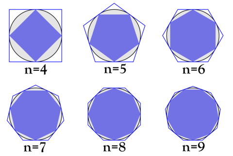
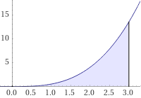
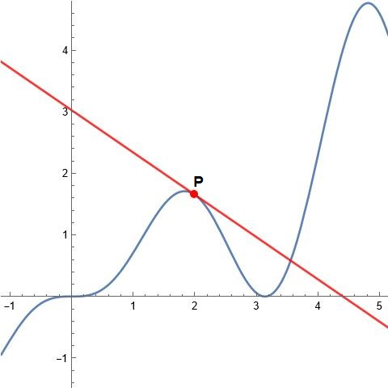
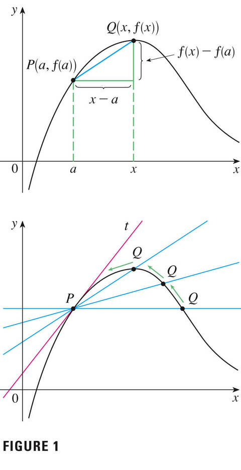
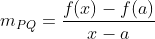
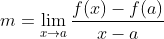

# Mas por que estudar Cálculo?

Em primeiro lugar, é preciso entender do que se trata o estudo de Cálculo e no que se baseia as exp    ressões matemáticas que serão abordadas. O Cálculo é o ramo da matemática que lida com coisas mais dinâmicas, que apresentam comportamentos que podem ser bem representados por gráficos de linhas. Como exemplo podemos pegar o movimento de uma bola que é chutada pelo goleiro em direção ao meio do campo de futebol. O percurso da bola pode ser descrito por um gráfico que traça a distância inicial (antes do goleiro chutar) até a distância final (quando atinge o chão) em relação ao tempo que ela demorou para realizar o trajeto. Esse caso pode ser matematicamente descrito como uma **função** que relaciona a distância (*s*) da bola no momento (*t*), sendo reescrita por *s(t)*, onde cada instante *t* estará associado a um valor *s*.

Agora que já foi apresentado o conceito inicial de funções matemáticas, vamos olhar mais produndamente os dois problemas fundamentais que deram origem ao estudo do cálculo. Eles são conhecidos como o "Problema da área" e o "Problema da tangente", onde ambos precisam lidar com o conceito de limite para se obter valores precisos de determinada função.

## O Problema da Área

O problema da área pode ser representado pelo caso do valor correto da área de um círculo, considerando que ele não possui lados contáveis que possibilite realizar o cálculo direto. Então, na Grécia antiga, foi desenvolvido uma maneira de calcular de forma aproximada a área do círculo com o "método da exaustão", o qual é utilizado para encontrar a área de qualquer polígono dividindo-o em triângulos e somar as áreas obtidas dos triângulos que formam determinada figura geométrica com certa quantidade de lados. Considerando *An* a área do polígono com *n* lados, então podemos assumir que a área do círculo pode ser interpretado como: 

onde a área do círculo é o limite da das áreas dos polígonos inscritos nele, em que os polígonos seguem a seguinte tendência quando aumentam a quantidade de lados:

Partindo dessa ideia, o cálculo possibilita encontrar a área de qualquer figura irregular ao aproximar a área total desconhecido com a soma da área de vária figuras de área conhecida, geralmente empregado na interpretação de gráficos.

O problema da área foi o que originou o ramo do cálculo conhecido como *cálculo integral*. Através dele podemos cálcular volumes de sólidos, comprimento de um arco, massa e centro de gravidade de objetos e muito mais.

## O Problema da Tangente

A tangente pode ser definida como a reta que toca a curva em um ponto e segue a inclinação da curva naquele ponto. Ok, eu sei. Esse conceito parece um tanto quanto abstrato e sem utilidade, mas vamos com calma.

Vamos analisar a seguinte imagem, onde existe a curva *y = f(x)* e um ponto P definido em *x = 2*.

A imagem acima também mostra uma reta que intercepta o ponto P seguindo inclinação da curva onde P está situado. Essa reta é o que conhecemos como reta tangente.

Certo, agora podemos fazer à seguinte pergunta: "e agora? para que serve isso?". O problema da tangente é sobre conseguir determinar a inclinação da reta tangente em determinado ponto, em que a inclinação dela é capaz de descrever a variação da função *f(x)* em dado momento *x*.

Enfim, chegamos a pergunta que realmente define o problema da tangente: como encontramos a inclinação da reta tangente que passa em certo ponto?

Para isso precisamos lembrar como encontrar a inclinação da reta que corta dois pontos, também conhecida como a *reta secante*. Assim, encontrando a inclinação da reta entre dois pontos, podemos deixar o ponto P fixo e deslocar o outro em direção a P o mais próximo possível. Desse modo, a inclinação da reta entre esses dois pontos muito próximos é equivalente a inclinação da reta tangente no ponto P.

No primeiro gráfico da figura acima estão os pontos P e Q ligados pela reta secante com inclinação *m(pq)* que pode ser encontrado seu valor pela equação

.

Com isso, quando tomamos a posição do ponto Q se aproximando do ponto P ao longo da curva, usamos o conceito de limite, definindo que a posição *x* do ponto Q tende à posição *a* do ponto P, conseguindo encontrar o valor da inclinação da tangente que passa no ponto desejado.

.

O problema da tangente foi o que originou o campo de estudo do cálculo denominado de *cálculo diferencial*, o qual foi inventado e definido de verdade mais de 2 mil anos depois do *cálculo integral*. O que se sabe é que o matemático francês Pierre Fermat (1601-1665) foi quem criou o conceito e os principais responsáveis por desenvolverem as ideias de Fermat foram John Wallis (1616-1703), Isaac Barrow (1630-1677), Isaac Newton (1642-1727) e Gottfried Leibniz (1646-1716).

Apesar de parecer que o problema da área e da tagente serem completamente diferentes, em estudos futuros veremos que apresentam forte relação na resolução de diversos outros problemas.

Um pequena observação: todos os conteúdos teóricos apresentados serão aplicados de alguma forma e colocados em posts separados com a tag "aplicacao" para que os posts não fiquem muito extensos e facilite para eu continuar publicando com certa frequência. Obrigado pela atenção e até a próxima.

> Materiais de base:
> Cálculo - Volume 1, 8° edição - James Stewart;
> O Cálculo com Geometria Analítica, Volume 1 - Louis Leithold.
